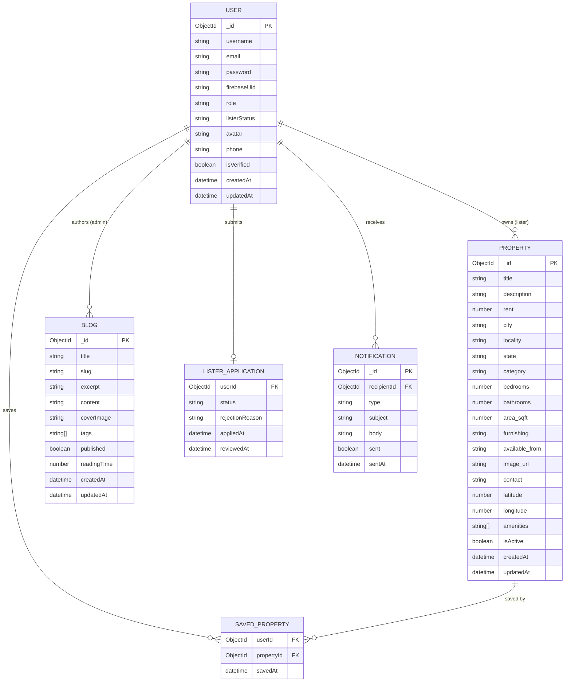

```mermaid
erDiagram
    USER {
        ObjectId _id PK
        string username
        string email
        string password
        string firebaseUid
        string role
        string listerStatus
        string avatar
        string phone
        boolean isVerified
        datetime createdAt
        datetime updatedAt
    }

    PROPERTY {
        ObjectId _id PK
        string title
        string description
        number rent
        string city
        string locality
        string state
        string category
        number bedrooms
        number bathrooms
        number area_sqft
        string furnishing
        string available_from
        string image_url
        string contact
        number latitude
        number longitude
        string[] amenities
        boolean isActive
        datetime createdAt
        datetime updatedAt
    }

    BLOG {
        ObjectId _id PK
        string title
        string slug
        string excerpt
        string content
        string coverImage
        string[] tags
        boolean published
        number readingTime
        datetime createdAt
        datetime updatedAt
    }

    SAVED_PROPERTY {
        ObjectId userId FK
        ObjectId propertyId FK
        datetime savedAt
    }

    LISTER_APPLICATION {
        ObjectId userId FK
        string status
        string rejectionReason
        datetime appliedAt
        datetime reviewedAt
    }

    NOTIFICATION {
        ObjectId _id PK
        ObjectId recipientId FK
        string type
        string subject
        string body
        boolean sent
        datetime sentAt
    }

    USER ||--o{ PROPERTY : "owns (lister)"
    USER ||--o{ BLOG : "authors (admin)"
    USER ||--o{ SAVED_PROPERTY : "saves"
    PROPERTY ||--o{ SAVED_PROPERTY : "saved by"
    USER ||--o| LISTER_APPLICATION : "submits"
    USER ||--o{ NOTIFICATION : "receives"
```