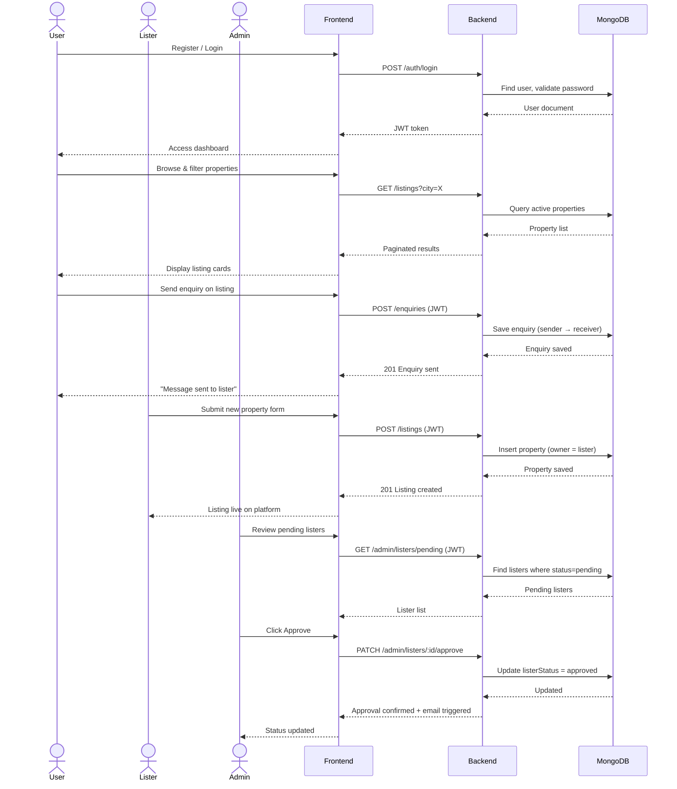

```mermaid
sequenceDiagram
    actor User
    actor Lister
    actor Admin
    participant Frontend
    participant Backend
    participant MongoDB

    %% Auth
    User ->> Frontend: Register / Login
    Frontend ->> Backend: POST /auth/login
    Backend ->> MongoDB: Find user, validate password
    MongoDB -->> Backend: User document
    Backend -->> Frontend: JWT token
    Frontend -->> User: Access dashboard

    %% Browse & Enquiry
    User ->> Frontend: Browse & filter properties
    Frontend ->> Backend: GET /listings?city=X
    Backend ->> MongoDB: Query active properties
    MongoDB -->> Backend: Property list
    Backend -->> Frontend: Paginated results
    Frontend -->> User: Display listing cards

    User ->> Frontend: Send enquiry on listing
    Frontend ->> Backend: POST /enquiries (JWT)
    Backend ->> MongoDB: Save enquiry (sender → receiver)
    MongoDB -->> Backend: Enquiry saved
    Backend -->> Frontend: 201 Enquiry sent
    Frontend -->> User: "Message sent to lister"

    %% Lister creates listing
    Lister ->> Frontend: Submit new property form
    Frontend ->> Backend: POST /listings (JWT)
    Backend ->> MongoDB: Insert property (owner = lister)
    MongoDB -->> Backend: Property saved
    Backend -->> Frontend: 201 Listing created
    Frontend -->> Lister: Listing live on platform

    %% Admin approves lister
    Admin ->> Frontend: Review pending listers
    Frontend ->> Backend: GET /admin/listers/pending (JWT)
    Backend ->> MongoDB: Find listers where status=pending
    MongoDB -->> Backend: Pending listers
    Backend -->> Frontend: Lister list
    Admin ->> Frontend: Click Approve
    Frontend ->> Backend: PATCH /admin/listers/:id/approve
    Backend ->> MongoDB: Update listerStatus = approved
    MongoDB -->> Backend: Updated
    Backend -->> Frontend: Approval confirmed + email triggered
    Frontend -->> Admin: Status updated

```