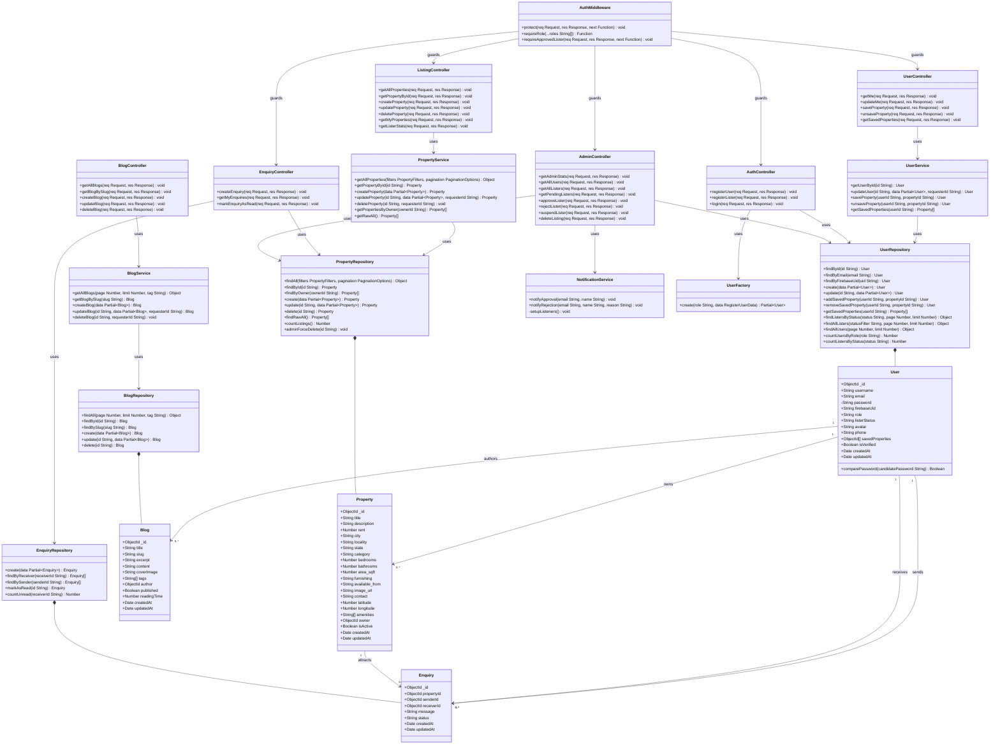

```mermaid
classDiagram

    %% ─────────────────────────────────────────
    %% MODELS
    %% ─────────────────────────────────────────

    class User {
        +ObjectId _id
        +String username
        +String email
        -String password
        +String firebaseUid
        +String role
        +String listerStatus
        +String avatar
        +String phone
        +ObjectId[] savedProperties
        +Boolean isVerified
        +Date createdAt
        +Date updatedAt
        +comparePassword(candidatePassword String) Boolean
    }

    class Property {
        +ObjectId _id
        +String title
        +String description
        +Number rent
        +String city
        +String locality
        +String state
        +String category
        +Number bedrooms
        +Number bathrooms
        +Number area_sqft
        +String furnishing
        +String available_from
        +String image_url
        +String contact
        +Number latitude
        +Number longitude
        +String[] amenities
        +ObjectId owner
        +Boolean isActive
        +Date createdAt
        +Date updatedAt
    }

    class Blog {
        +ObjectId _id
        +String title
        +String slug
        +String excerpt
        +String content
        +String coverImage
        +String[] tags
        +ObjectId author
        +Boolean published
        +Number readingTime
        +Date createdAt
        +Date updatedAt
    }

    class Enquiry {
        +ObjectId _id
        +ObjectId propertyId
        +ObjectId senderId
        +ObjectId receiverId
        +String message
        +String status
        +Date createdAt
        +Date updatedAt
    }

    %% ─────────────────────────────────────────
    %% REPOSITORIES
    %% ─────────────────────────────────────────

    class UserRepository {
        +findById(id String) User
        +findByEmail(email String) User
        +findByFirebaseUid(uid String) User
        +create(data Partial~User~) User
        +update(id String, data Partial~User~) User
        +addSavedProperty(userId String, propertyId String) User
        +removeSavedProperty(userId String, propertyId String) User
        +getSavedProperties(userId String) Property[]
        +findListersByStatus(status String, page Number, limit Number) Object
        +findAllListers(statusFilter String, page Number, limit Number) Object
        +findAllUsers(page Number, limit Number) Object
        +countUsersByRole(role String) Number
        +countListersByStatus(status String) Number
    }

    class PropertyRepository {
        +findAll(filters PropertyFilters, pagination PaginationOptions) Object
        +findById(id String) Property
        +findByOwner(ownerId String) Property[]
        +create(data Partial~Property~) Property
        +update(id String, data Partial~Property~) Property
        +delete(id String) Property
        +findRawAll() Property[]
        +countListings() Number
        +adminForceDelete(id String) void
    }

    class BlogRepository {
        +findAll(page Number, limit Number, tag String) Object
        +findById(id String) Blog
        +findBySlug(slug String) Blog
        +create(data Partial~Blog~) Blog
        +update(id String, data Partial~Blog~) Blog
        +delete(id String) Blog
    }

    class EnquiryRepository {
        +create(data Partial~Enquiry~) Enquiry
        +findByReceiver(receiverId String) Enquiry[]
        +findBySender(senderId String) Enquiry[]
        +markAsRead(id String) Enquiry
        +countUnread(receiverId String) Number
    }

    %% ─────────────────────────────────────────
    %% SERVICES
    %% ─────────────────────────────────────────

    class UserService {
        +getUserById(id String) User
        +updateUser(id String, data Partial~User~, requesterId String) User
        +saveProperty(userId String, propertyId String) User
        +unsaveProperty(userId String, propertyId String) User
        +getSavedProperties(userId String) Property[]
    }

    class PropertyService {
        +getAllProperties(filters PropertyFilters, pagination PaginationOptions) Object
        +getPropertyById(id String) Property
        +createProperty(data Partial~Property~) Property
        +updateProperty(id String, data Partial~Property~, requesterId String) Property
        +deleteProperty(id String, requesterId String) void
        +getPropertiesByOwner(ownerId String) Property[]
        +getRawAll() Property[]
    }

    class BlogService {
        +getAllBlogs(page Number, limit Number, tag String) Object
        +getBlogBySlug(slug String) Blog
        +createBlog(data Partial~Blog~) Blog
        +updateBlog(id String, data Partial~Blog~, requesterId String) Blog
        +deleteBlog(id String, requesterId String) void
    }

    class NotificationService {
        +notifyApproval(email String, name String) void
        +notifyRejection(email String, name String, reason String) void
        -setupListeners() void
    }

    %% ─────────────────────────────────────────
    %% FACTORY
    %% ─────────────────────────────────────────

    class UserFactory {
        +create(role String, data RegisterUserData) Partial~User~
    }

    %% ─────────────────────────────────────────
    %% MIDDLEWARE
    %% ─────────────────────────────────────────

    class AuthMiddleware {
        +protect(req Request, res Response, next Function) void
        +requireRole(...roles String[]) Function
        +requireApprovedLister(req Request, res Response, next Function) void
    }

    %% ─────────────────────────────────────────
    %% CONTROLLERS
    %% ─────────────────────────────────────────

    class AuthController {
        +registerUser(req Request, res Response) void
        +registerLister(req Request, res Response) void
        +login(req Request, res Response) void
    }

    class UserController {
        +getMe(req Request, res Response) void
        +updateMe(req Request, res Response) void
        +saveProperty(req Request, res Response) void
        +unsaveProperty(req Request, res Response) void
        +getSavedProperties(req Request, res Response) void
    }

    class ListingController {
        +getAllProperties(req Request, res Response) void
        +getPropertyById(req Request, res Response) void
        +createProperty(req Request, res Response) void
        +updateProperty(req Request, res Response) void
        +deleteProperty(req Request, res Response) void
        +getMyProperties(req Request, res Response) void
        +getListerStats(req Request, res Response) void
    }

    class BlogController {
        +getAllBlogs(req Request, res Response) void
        +getBlogBySlug(req Request, res Response) void
        +createBlog(req Request, res Response) void
        +updateBlog(req Request, res Response) void
        +deleteBlog(req Request, res Response) void
    }

    class EnquiryController {
        +createEnquiry(req Request, res Response) void
        +getMyEnquiries(req Request, res Response) void
        +markEnquiryAsRead(req Request, res Response) void
    }

    class AdminController {
        +getAdminStats(req Request, res Response) void
        +getAllUsers(req Request, res Response) void
        +getAllListers(req Request, res Response) void
        +getPendingListers(req Request, res Response) void
        +approveLister(req Request, res Response) void
        +rejectLister(req Request, res Response) void
        +suspendLister(req Request, res Response) void
        +deleteListing(req Request, res Response) void
    }

    %% ─────────────────────────────────────────
    %% RELATIONSHIPS
    %% ─────────────────────────────────────────

    %% Model associations
    User "1" --> "0..*" Property : owns
    User "1" --> "0..*" Blog : authors
    User "1" --> "0..*" Enquiry : sends
    User "1" --> "0..*" Enquiry : receives
    Property "1" --> "0..*" Enquiry : attracts

    %% Repository ↔ Model (composition)
    UserRepository *-- User
    PropertyRepository *-- Property
    BlogRepository *-- Blog
    EnquiryRepository *-- Enquiry

    %% Service → Repository (dependency)
    UserService --> UserRepository : uses
    PropertyService --> PropertyRepository : uses
    BlogService --> BlogRepository : uses

    %% Controller → Service (dependency)
    AuthController --> UserRepository : uses
    AuthController --> UserFactory : uses
    UserController --> UserService : uses
    ListingController --> PropertyService : uses
    BlogController --> BlogService : uses
    EnquiryController --> EnquiryRepository : uses
    EnquiryController --> PropertyRepository : uses
    AdminController --> UserRepository : uses
    AdminController --> PropertyRepository : uses
    AdminController --> NotificationService : uses

    %% Middleware guards controllers
    AuthMiddleware --> AuthController : guards
    AuthMiddleware --> UserController : guards
    AuthMiddleware --> ListingController : guards
    AuthMiddleware --> EnquiryController : guards
    AuthMiddleware --> AdminController : guards
```